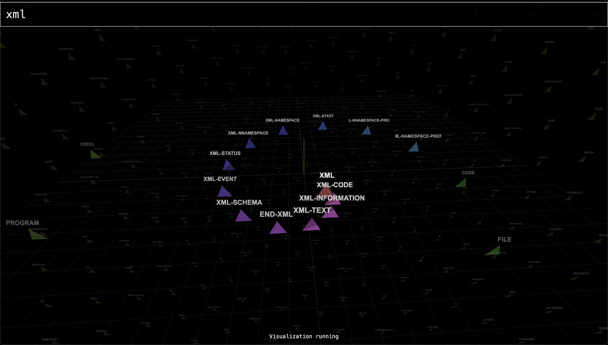

# Word Vector Simulation Prototype

A 3D visualization application that uses word embeddings to create physics-based simulations of semantic relationships between words.

## Prerequisites

Before running this application, you need to install the following dependencies:

### 1. Bun

Bun is a fast JavaScript runtime and package manager.

**macOS/Linux:**
```bash
curl -fsSL https://bun.sh/install | bash
```

**Windows:**
```bash
powershell -c "irm bun.sh/install.ps1 | iex"
```

For other installation methods, visit [https://bun.sh](https://bun.sh)

### 2. Ollama

Ollama is required for generating word embeddings locally.

**macOS:**
```bash
brew install ollama
```

**Linux:**
```bash
curl -fsSL https://ollama.com/install.sh | sh
```

**Windows:**
Download and run the installer from [https://ollama.com/download](https://ollama.com/download)

### 3. Install the Required Model

After installing Ollama, you need to pull the `all-minilm` model:

```bash
# Start Ollama service (if not already running)
ollama serve

# In a new terminal, pull the model
ollama pull all-minilm:latest
```

## Installation

1. Clone this repository:
```bash
git clone https://github.com/yourusername/word-vector-simulation-prototype.git
cd word-vector-simulation-prototype
```

2. Install dependencies:
```bash
bun install
```

## Running the Application

1. Make sure Ollama is running in the background:
```bash
ollama serve
```
The Ollama API should be available at `http://localhost:11434`

2. Start the application:
```bash
bun run start
```

Or for development mode with auto-reload:
```bash
bun run dev
```

3. Open your browser and navigate to:
```
http://localhost:3000
```

## Alternative: Using the start script

You can also run the application using the provided shell script:
```bash
chmod +x start.sh
./start.sh
```

## Architecture

- **Backend**: Bun.js server that handles API requests and serves static files
- **Embeddings**: Ollama with the `all-minilm:latest` model for generating word vectors
- **Frontend**: Custom HTML elements with Three.js for 3D visualization and RAPIER for physics simulation
- **API Endpoint**: `/api/embed` - POST endpoint that accepts text and returns embedding vectors

## Troubleshooting

### Ollama Connection Error
If you see errors related to Ollama connection:
1. Ensure Ollama is running: `ollama serve`
2. Verify the model is installed: `ollama list` (should show `all-minilm:latest`)
3. Check that Ollama is accessible at `http://localhost:11434`

### Port Already in Use
If port 3000 is already in use, you can modify the port in `server.js`:
```javascript
const server = serve({
  port: 3001, // Change to your preferred port
  // ...
})
```

### Missing Dependencies
If you encounter module errors, try:
```bash
bun install --force
```

## Development

The application uses:
- Custom DataRoom elements for UI components
- Three.js for 3D rendering
- RAPIER physics engine for simulations
- D3.js for data visualization
- Ollama's all-minilm model for semantic embeddings

## License

[Your License Here]
